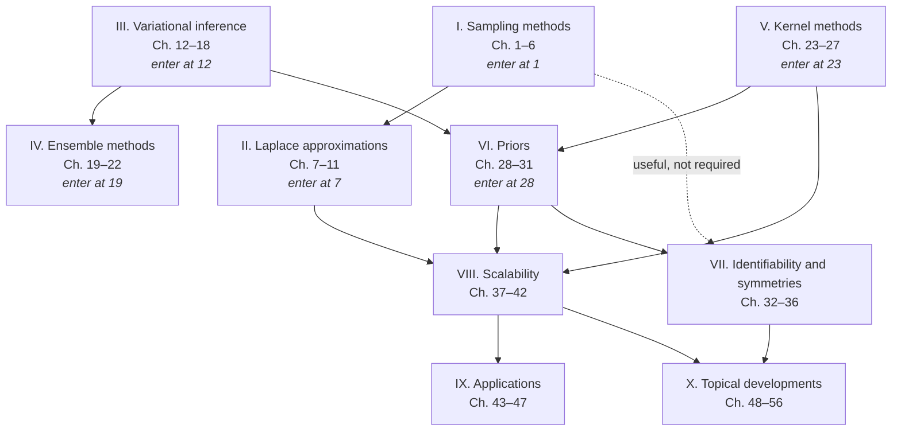

# Reader's guide

:::{note} How to read this book
You do not have to read this book from front to back. It is written to be used like a reference work—or a wiki—in which almost every chapter is a self-contained entry that you can open on its own. Find the topic you need, read that chapter, and follow its cross-references outwards only as far as your question requires. This guide tells you where to start, what each chapter assumes, and which routes through the book are worth taking.
:::

## What this book covers

Bayesian deep learning (BDL) asks how the machinery of Bayesian inference—priors, posteriors, predictive distributions, marginal likelihoods, and the decisions they license—can be brought to bear on models with millions or billions of parameters, for which none of the classical guarantees or algorithms apply unmodified. This book covers that question in ten parts. Five of them develop the major families of approximate inference used in practice: Monte Carlo sampling ([Part I](#part:sampling_methods)), Laplace approximations ([Part II](#part:laplace_approximations)), variational inference ([Part III](#part:vi)), ensembles ([Part IV](#part:ensemble_methods)), and kernel and Gaussian-process methods ([Part V](#part:kernel_methods)). Two cover the modelling questions that are assumed as prerequisites by the aforementioned algorithms: what a prior over a neural network actually means ([Part VI](#part:priors)), and what the symmetries and non-identifiability of neural parameterisations do to inference and interpretation ([Part VII](#part:identifiability_and_symmetries)). One is devoted to making all of this run at modern scale ([Part VIII](#part:scalability)), one to worked applications and software ([Part IX](#part:applications)), and the last to topics at the current research frontier, from diffusion models and singular learning theory to causal, credal, and reinforcement-learning extensions ([Part X](#part:topical_developments)). The parts are largely parallel rather than sequential: they are alternative and complementary answers to the same problem, and comparing them is a large part of what the book is for.

## How the book is organised

Several deliberate choices make non-linear reading possible, and it is worth knowing about them before you start.

**Parts have entry chapters.** Most parts open with an introductory chapter that sets up the problem, fixes the notation for that family of methods, and previews the chapters that follow. These entry chapters are short, self-contained, and written for readers arriving cold. If you want to know what a part is about without committing to it, read only its entry chapter.

**Notation is shared across the whole book.** A single set of symbols is used throughout, defined by shared macros and summarised in the mathematical glossary in the front matter. Whenever a chapter writes $\theta$ for network parameters, $f(x,\theta)$ for the network, or $\mathcal{D}$ for the training data, it means the same thing as every other chapter. If an unfamiliar symbol appears, the glossary is the first place to look.

**Chapters are cross-referenced, not chained.** Where a chapter uses a result developed elsewhere, it says so and points to the specific chapter. Treat those pointers as hyperlinks rather than as instructions: follow them when you need the derivation, and ignore them when you are happy to take the result on trust.

**Coverage is broad by design.** The book is a collaborative work by many authors, and different chapters are pitched at different levels—some are tutorial, some survey a literature, some present a specific recent framework in depth. This is a feature for a reference work. It does mean that reading order should follow your interests rather than the page numbers.

## Six chapters that unlock the rest

If you are new to the field, the fastest way in is not to start at [Chapter 1](#chap:sampling:intro) and read on. It is to read the following six entry chapters, which between them establish essentially all of the vocabulary the remaining fifty chapters rely on.

- [Chapter 12](#chap:vi_intro), on the evidence lower bound and inference as optimisation. This is the single most widely reused chapter in the book.
- [Chapter 1](#chap:sampling:intro), on Monte Carlo, Markov chain Monte Carlo, Hamiltonian Monte Carlo, and convergence diagnostics.
- [Chapter 7](#cha:laplace:introduction), on the Laplace approximation and why a Gaussian around a trained network is the cheapest useful posterior.
- [Chapter 19](#chap:ensemble_methods_intro), on deep ensembles and their relation to Bayesian model averaging.
- [Chapter 23](#chap:kernel_methods_intro), on kernels, reproducing kernel Hilbert spaces, and Gaussian processes—the function-space view used throughout.
- [Chapter 28](#chap:priors_intro), on what a prior over a neural network is and what it does.

With these six in hand, any other chapter in the book becomes accessible, and the per-chapter prerequisites in [Tables 1](#tab:readerguide:prereq-early) and [2](#tab:readerguide:prereq-late) tell you what else, if anything, a given chapter expects.

## The ten parts at a glance

**[Part I](#part:sampling_methods), Sampling methods ([Chapters 1](#chap:sampling:intro)–[6](#chap:sampling_methods_discrete_sampling)).** Asymptotically exact posterior inference by simulation. [Chapter 1](#chap:sampling:intro) covers Monte Carlo, rejection and importance sampling, Metropolis–Hastings, Gibbs, MALA, HMC, diagnostics, and sequential Monte Carlo; [Chapter 2](#chap:sampling_methods_sg_mcmc) makes MCMC compatible with mini-batching (SGLD, SG-HMC, cyclical schedules); [Chapter 3](#chap:sbi:intro) treats likelihood-free inference for black-box simulators; [Chapter 4](#chap:smcs) develops multilevel and parallel SMC samplers; [Chapter 5](#chap:sampling_methods_low_precision_sampling) asks what low-precision arithmetic does to a Markov chain; and [Chapter 6](#chap:sampling_methods_discrete_sampling) covers gradient-based samplers on discrete spaces. Start at [Chapter 1](#chap:sampling:intro); the remaining five chapters can then be read in any order, and [Chapter 3](#chap:sbi:intro) is nearly independent of the rest.

**[Part II](#part:laplace_approximations), Laplace approximations ([Chapters 7](#cha:laplace:introduction)–[11](#cha:laplace:model_selection)).** The cheapest route from an already-trained network to a posterior: a Gaussian centred at the optimum with curvature-derived covariance. [Chapter 7](#cha:laplace:introduction) motivates and derives it; [Chapter 8](#cha:laplace:linearized) turns it into a Gaussian process over functions and introduces the generalised Gauss–Newton matrix and its scalable approximations; [Chapter 9](#cha:laplace:diffgeo) views the same object through the lens of Riemannian and information geometry; [Chapter 10](#cha:laplace:analytic_functionality) extracts closed-form predictive and decision-theoretic quantities from it; and [Chapter 11](#cha:laplace:model_selection) uses the resulting marginal likelihood for model selection. Read the first two in order, then whichever of the last three you need.

**[Part III](#part:vi), Variational inference ([Chapters 12](#chap:vi_intro)–[18](#chap:vi_sequential_vi)).** Inference recast as optimisation over a family of distributions. [Chapter 12](#chap:vi_intro) derives the evidence lower bound; [Chapter 13](#chap:vi_mean_field_vi) develops the Gaussian mean-field workhorse, coordinate ascent, and the reparameterisation gradient; [Chapter 14](#chap:vi_dropout_based_vi) shows that dropout at test time is a variational approximation; [Chapter 15](#chap:vi_natural_gradient_vi) exploits the geometry of distribution space and derives practical optimisers such as VON, VOGN, and IVON; [Chapter 16](#chap:vi_particle_based_vi) replaces the parametric family with interacting particles (SVGD and gradient flows); [Chapter 17](#chap:vi_function_space_vi) moves the variational problem into function space; and [Chapter 18](#chap:vi_sequential_vi) handles streaming and non-stationary data through filtering. Read [Chapters 12](#chap:vi_intro)–[13](#chap:vi_mean_field_vi) in order; the remaining five are independent branches.

**[Part IV](#part:ensemble_methods), Ensemble methods ([Chapters 19](#chap:ensemble_methods_intro)–[22](#chap:ensemble_methods_pac_bayesian_ensembles)).** The most widely deployed approach in practice, and the one with the lightest prerequisites. [Chapter 19](#chap:ensemble_methods_intro) explains why retraining from different initialisations approximates Bayesian model averaging; [Chapter 20](#chap:ensemble_methods_hybrid_ensemble_sampling) combines ensembling with sampling to explore multimodal posteriors; [Chapter 21](#chap:ensemble_methods_practical_applications) surveys applications from mixtures of experts to weather forecasting; and [Chapter 22](#chap:ensemble_methods_pac_bayesian_ensembles) gives PAC-Bayesian generalisation bounds for weighted majority votes. Readers who want to see something work before studying inference machinery can begin here.

**[Part V](#part:kernel_methods), Kernel methods ([Chapters 23](#chap:kernel_methods_intro)–[27](#chap:kernel_methods_meta_learning)).** The function-space tradition, and the bridge between deep networks and exact Bayesian inference. [Chapter 23](#chap:kernel_methods_intro) covers feature maps, kernels, RKHS, and Gaussian processes; [Chapter 24](#chap:kernel_methods_dkl) learns the kernel with a neural network (deep kernel learning); [Chapter 25](#chap:kernel_methods_dgps) composes Gaussian processes into deep Gaussian processes; [Chapter 26](#chap:kernel_methods_dkps_dkms) develops deep kernel processes and machines together with the infinite-width limit; and [Chapter 27](#chap:kernel_methods_meta_learning) meta-learns deep kernels for small-data tasks. [Chapter 23](#chap:kernel_methods_intro) first; the rest branch from it.

**[Part VI](#part:priors), Priors ([Chapters 28](#chap:priors_intro)–[31](#chap:priors_function_space_priors)).** What a prior over weights actually says about functions. [Chapter 28](#chap:priors_intro) surveys the main families and the role of the prior predictive; [Chapter 29](#chap:priors_stat_properties) studies their statistical properties, including tail behaviour, infinite-width limits, and posterior contraction; [Chapter 30](#chap:priors_informative_priors) constructs informative, data-driven priors; and [Chapter 31](#chap:priors_function_space_priors) specifies priors directly in function space and matches weight-space priors to them. This part is short and unusually high-leverage: it explains a great many empirical observations reported elsewhere in the book.

**[Part VII](#part:identifiability_and_symmetries), Identifiability and symmetries ([Chapters 32](#cha:ident:sym_intro)–[36](#cha:ident:softmax_gating)).** Neural parameterisations are massively redundant, and this has consequences. [Chapter 32](#cha:ident:sym_intro) catalogues weight-space symmetries and mode connectivity; [Chapter 33](#cha:ident:sym_sampling) works out what they do to samplers and to convergence diagnostics; [Chapter 34](#cha:ident:identifying_symmetries) turns the question around and learns invariances and inductive biases from data; [Chapter 35](#cha:ident:interpretable_bay_pyr) constructs deep generative models that are identifiable by design; and [Chapter 36](#cha:ident:softmax_gating) analyses Bayesian mixtures of experts with softmax gating. Start at [Chapter 32](#cha:ident:sym_intro); the last three chapters are independent of one another.

**[Part VIII](#part:scalability), Scalability ([Chapters 37](#chap:scalability_single_forward_pass)–[42](#chap:scalability_compression_without_quantization)).** Making the preceding methods affordable. [Chapter 37](#chap:scalability_single_forward_pass) covers methods that produce uncertainty from one forward pass; [Chapter 38](#chap:scalability_scalable_gps) covers sparse, inducing-point, and spectral approximations for Gaussian processes; [Chapter 39](#chap:scalability_last_layer_inference) restricts inference to the final layer; [Chapter 40](#chap:scalability_scalable_laplace) scales the Laplace approximation through structured curvature, function-space duality, and iterative solvers; and [Chapters 41](#chap:scalability_compression_with_quantization) and [42](#chap:scalability_compression_without_quantization) form a self-contained pair on Bayesian data compression, with and without quantisation. This is the part practitioners tend to need soonest.

**[Part IX](#part:applications), Applications ([Chapters 43](#chap:applications_bayesian_llms)–[47](#chap:applications_software_for_bdl)).** Worked end-to-end problems. [Chapter 43](#chap:applications_bayesian_llms) covers Bayesian treatment of large language models, including Bayesian fine-tuning and model merging; [Chapter 44](#chap:applications_selective_classification) evaluates uncertainty quantification methods head-to-head through selective classification; [Chapter 45](#chap:applications_biomedical_data_imputation) treats missing biomedical data with deep generative models; [Chapter 46](#chap:applications_spatiotemporal_modelling) develops hybrid Bayesian hierarchical and deep models for wildfire extremes and spread; and [Chapter 47](#chap:applications_software_for_bdl) surveys the software ecosystem. Any of these can be read early, as motivation. If you intend to implement something, [Chapter 47](#chap:applications_software_for_bdl) is worth reading first.

**[Part X](#part:topical_developments), Topical developments ([Chapters 48](#chap:topical_developments_subspace_inference)–[56](#chap:topical_developments_bayesian_rl)).** Nine largely independent chapters at the research frontier: low-dimensional subspace inference ([Chapter 48](#chap:topical_developments_subspace_inference)); a behavioural characterisation of what makes a predictor Bayesian ([Chapter 49](#chap:topical_developments_implicitly_bayesian_prediction)); diffusion models ([Chapter 50](#chap:topical_developments_diffusion_models)); prior-data fitted networks and amortised in-context prediction ([Chapter 51](#chap:topical_developments_meta_models)); singular learning theory and what it corrects about the standard asymptotic picture ([Chapter 52](#chap:topical_developments_singular_learning_theory)); active learning and Bayesian experimental design ([Chapter 53](#chap:topical_developments_active_learning)); causal-aware BDL ([Chapter 54](#chap:topical_developments_causal_aware_bdl)); credal sets and imprecise probability for separating aleatoric from epistemic uncertainty ([Chapter 55](#chap:topical_developments_credal_bdl)); and Bayesian reinforcement learning ([Chapter 56](#chap:topical_developments_bayesian_rl)). Read whichever interests you; none of them requires another.

## A map of the parts

[Figure 1](#fig:readerguide:partmap) shows how the parts depend on one another. It is a map, not a timetable: an arrow records that the target part will make more sense if you have seen the source, not that you are forbidden from starting elsewhere. Three parts have no incoming arrows and are therefore legitimate places to begin—sampling, variational inference, and kernel methods—and each corresponds to one of the three distinct ways this book views a posterior: as something to simulate, as something to optimise, and as something to specify directly over functions. Choosing a starting point among them is largely a matter of taste.

(fig:readerguide:partmap)=

*Figure 1. Recommended dependences between the ten parts. Solid arrows mark background the target part assumes; the dashed arrow marks material that enriches it without being required. The entry parts—Sampling methods, Variational inference, and Kernel methods—have no prerequisites and can be read first.*

## Chapter-level prerequisites

[Tables 1](#tab:readerguide:prereq-early) and [2](#tab:readerguide:prereq-late) give, for every chapter, the small number of chapters worth reading first and a second list of chapters that deepen it. The first list is deliberately short: it names what a chapter genuinely leans on, not everything related to it. Chapters with an empty first column need nothing beyond a standard background in probability, linear algebra, and deep learning. Used together with the map in [Figure 1](#fig:readerguide:partmap), these tables let you assemble your own route: pick the chapter you actually want, take the transitive closure of its prerequisites, and read that—usually two or three chapters rather than forty.

:::{table} Chapter-level prerequisites for Parts [I](#part:sampling_methods)–[V](#part:kernel_methods). “Read first” lists the chapters a chapter leans on; “also useful” lists chapters that deepen it but are not required.
:label: tab:readerguide:prereq-early

| Ch. | Topic | Read first | Also useful |
| --- | --- | --- | --- |
***[Part I](#part:sampling_methods): Sampling methods***

| [1](#chap:sampling:intro) | Introduction to sampling | — | — |
| --- | --- | --- | --- |
| [2](#chap:sampling_methods_sg_mcmc) | Stochastic gradient MCMC | [1](#chap:sampling:intro) | [5](#chap:sampling_methods_low_precision_sampling) |
| [3](#chap:sbi:intro) | Simulation-based inference | [1](#chap:sampling:intro) | [12](#chap:vi_intro), [50](#chap:topical_developments_diffusion_models), [51](#chap:topical_developments_meta_models) |
| [4](#chap:smcs) | Sequential Monte Carlo samplers | [1](#chap:sampling:intro) | [31](#chap:priors_function_space_priors), [19](#chap:ensemble_methods_intro) |
| [5](#chap:sampling_methods_low_precision_sampling) | Low-precision sampling | [1](#chap:sampling:intro), [2](#chap:sampling_methods_sg_mcmc) | [41](#chap:scalability_compression_with_quantization) |
| [6](#chap:sampling_methods_discrete_sampling) | Discrete sampling | [1](#chap:sampling:intro) | [2](#chap:sampling_methods_sg_mcmc) |
***[Part II](#part:laplace_approximations): Laplace approximations***

| [7](#cha:laplace:introduction) | Introduction to Laplace approximations | — | [Part I](#part:sampling_methods), for contrast |
| --- | --- | --- | --- |
| [8](#cha:laplace:linearized) | Linearised Laplace approximations | [7](#cha:laplace:introduction) | [23](#chap:kernel_methods_intro), [15](#chap:vi_natural_gradient_vi) |
| [9](#cha:laplace:diffgeo) | Differential-geometric perspective | [8](#cha:laplace:linearized) | [15](#chap:vi_natural_gradient_vi), [32](#cha:ident:sym_intro) |
| [10](#cha:laplace:analytic_functionality) | Analytic predictive functionality | [7](#cha:laplace:introduction), [8](#cha:laplace:linearized) | [53](#chap:topical_developments_active_learning), [44](#chap:applications_selective_classification) |
| [11](#cha:laplace:model_selection) | Model selection via marginal likelihood | [7](#cha:laplace:introduction), [8](#cha:laplace:linearized) | [40](#chap:scalability_scalable_laplace), [34](#cha:ident:identifying_symmetries) |
***[Part III](#part:vi): Variational inference***

| [12](#chap:vi_intro) | Introduction to variational inference | — | — |
| --- | --- | --- | --- |
| [13](#chap:vi_mean_field_vi) | Gaussian mean-field VI | [12](#chap:vi_intro) | — |
| [14](#chap:vi_dropout_based_vi) | Dropout-based VI | [12](#chap:vi_intro) | [24](#chap:kernel_methods_dkl), [19](#chap:ensemble_methods_intro) |
| [15](#chap:vi_natural_gradient_vi) | Natural-gradient VI | [12](#chap:vi_intro), [13](#chap:vi_mean_field_vi) | [8](#cha:laplace:linearized), [43](#chap:applications_bayesian_llms) |
| [16](#chap:vi_particle_based_vi) | Particle-based VI | [12](#chap:vi_intro), [1](#chap:sampling:intro) | [2](#chap:sampling_methods_sg_mcmc), [50](#chap:topical_developments_diffusion_models) |
| [17](#chap:vi_function_space_vi) | VI in function space | [12](#chap:vi_intro), [23](#chap:kernel_methods_intro) | [31](#chap:priors_function_space_priors), [38](#chap:scalability_scalable_gps) |
| [18](#chap:vi_sequential_vi) | Sequential VI | [12](#chap:vi_intro), [15](#chap:vi_natural_gradient_vi) | [1](#chap:sampling:intro), [8](#cha:laplace:linearized) |
***[Part IV](#part:ensemble_methods): Ensemble methods***

| [19](#chap:ensemble_methods_intro) | Introduction to deep ensembles | — | [12](#chap:vi_intro) |
| --- | --- | --- | --- |
| [20](#chap:ensemble_methods_hybrid_ensemble_sampling) | Hybrid ensemble sampling | [19](#chap:ensemble_methods_intro), [2](#chap:sampling_methods_sg_mcmc) | [32](#cha:ident:sym_intro), [33](#cha:ident:sym_sampling) |
| [21](#chap:ensemble_methods_practical_applications) | Practical applications of ensembles | [19](#chap:ensemble_methods_intro) | [36](#cha:ident:softmax_gating), [47](#chap:applications_software_for_bdl) |
| [22](#chap:ensemble_methods_pac_bayesian_ensembles) | PAC-Bayesian ensembles | [19](#chap:ensemble_methods_intro) | [12](#chap:vi_intro), [49](#chap:topical_developments_implicitly_bayesian_prediction) |
***[Part V](#part:kernel_methods): Kernel methods***

| [23](#chap:kernel_methods_intro) | Introduction to kernel methods | — | — |
| --- | --- | --- | --- |
| [24](#chap:kernel_methods_dkl) | Deep kernel learning | [23](#chap:kernel_methods_intro) | [37](#chap:scalability_single_forward_pass), [39](#chap:scalability_last_layer_inference) |
| [25](#chap:kernel_methods_dgps) | Deep Gaussian processes | [23](#chap:kernel_methods_intro) | [12](#chap:vi_intro), [38](#chap:scalability_scalable_gps) |
| [26](#chap:kernel_methods_dkps_dkms) | Deep kernel processes and machines | [23](#chap:kernel_methods_intro), [25](#chap:kernel_methods_dgps) | [31](#chap:priors_function_space_priors) |
| [27](#chap:kernel_methods_meta_learning) | Meta-learning deep kernel GPs | [23](#chap:kernel_methods_intro), [24](#chap:kernel_methods_dkl) | [53](#chap:topical_developments_active_learning) |
:::

:::{table} Chapter-level prerequisites for Parts [VI](#part:priors)–[X](#part:topical_developments). Conventions as in [Table 1](#tab:readerguide:prereq-early).
:label: tab:readerguide:prereq-late

| Ch. | Topic | Read first | Also useful |
| --- | --- | --- | --- |
***[Part VI](#part:priors): Priors***

| [28](#chap:priors_intro) | Introduction to priors | — | [12](#chap:vi_intro), [23](#chap:kernel_methods_intro) |
| --- | --- | --- | --- |
| [29](#chap:priors_stat_properties) | Statistical properties of priors | [28](#chap:priors_intro) | [25](#chap:kernel_methods_dgps), [52](#chap:topical_developments_singular_learning_theory) |
| [30](#chap:priors_informative_priors) | Informative priors | [28](#chap:priors_intro) | [13](#chap:vi_mean_field_vi), [39](#chap:scalability_last_layer_inference) |
| [31](#chap:priors_function_space_priors) | Function-space priors | [28](#chap:priors_intro), [23](#chap:kernel_methods_intro) | [17](#chap:vi_function_space_vi) |
***[Part VII](#part:identifiability_and_symmetries): Identifiability and symmetries***

| [32](#cha:ident:sym_intro) | Symmetries in Bayesian neural networks | — | [28](#chap:priors_intro) |
| --- | --- | --- | --- |
| [33](#cha:ident:sym_sampling) | Symmetries and sampling | [32](#cha:ident:sym_intro), [1](#chap:sampling:intro) | [2](#chap:sampling_methods_sg_mcmc), [48](#chap:topical_developments_subspace_inference) |
| [34](#cha:ident:identifying_symmetries) | Learning inductive bias and symmetries | [32](#cha:ident:sym_intro), [11](#cha:laplace:model_selection) | [13](#chap:vi_mean_field_vi), [40](#chap:scalability_scalable_laplace) |
| [35](#cha:ident:interpretable_bay_pyr) | Identifiable deep generative models | [32](#cha:ident:sym_intro) | [52](#chap:topical_developments_singular_learning_theory) |
| [36](#cha:ident:softmax_gating) | Bayesian mixtures of experts | [32](#cha:ident:sym_intro) | [1](#chap:sampling:intro), [13](#chap:vi_mean_field_vi) |
***[Part VIII](#part:scalability): Scalability***

| [37](#chap:scalability_single_forward_pass) | Single-forward-pass inference | [24](#chap:kernel_methods_dkl), [19](#chap:ensemble_methods_intro) | [38](#chap:scalability_scalable_gps), [39](#chap:scalability_last_layer_inference) |
| --- | --- | --- | --- |
| [38](#chap:scalability_scalable_gps) | Scalable Gaussian processes | [23](#chap:kernel_methods_intro) | [12](#chap:vi_intro), [15](#chap:vi_natural_gradient_vi) |
| [39](#chap:scalability_last_layer_inference) | Last-layer inference | [38](#chap:scalability_scalable_gps), [28](#chap:priors_intro) | [8](#cha:laplace:linearized), [2](#chap:sampling_methods_sg_mcmc) |
| [40](#chap:scalability_scalable_laplace) | Scalable Laplace approximations | [7](#cha:laplace:introduction), [8](#cha:laplace:linearized) | [38](#chap:scalability_scalable_gps), [17](#chap:vi_function_space_vi) |
| [41](#chap:scalability_compression_with_quantization) | Bayesian compression with quantisation | [12](#chap:vi_intro), [13](#chap:vi_mean_field_vi) | [5](#chap:sampling_methods_low_precision_sampling) |
| [42](#chap:scalability_compression_without_quantization) | Compression with stochastic codes | [41](#chap:scalability_compression_with_quantization) | [1](#chap:sampling:intro), [50](#chap:topical_developments_diffusion_models) |
***[Part IX](#part:applications): Applications***

| [43](#chap:applications_bayesian_llms) | Bayesian large language models | [15](#chap:vi_natural_gradient_vi) | [8](#cha:laplace:linearized), [39](#chap:scalability_last_layer_inference) |
| --- | --- | --- | --- |
| [44](#chap:applications_selective_classification) | Selective classification | — | [8](#cha:laplace:linearized), [19](#chap:ensemble_methods_intro), [53](#chap:topical_developments_active_learning) |
| [45](#chap:applications_biomedical_data_imputation) | Biomedical data imputation | [12](#chap:vi_intro), [13](#chap:vi_mean_field_vi) | [30](#chap:priors_informative_priors) |
| [46](#chap:applications_spatiotemporal_modelling) | Spatio-temporal modelling of wildfires | [12](#chap:vi_intro), [13](#chap:vi_mean_field_vi) | [19](#chap:ensemble_methods_intro) |
| [47](#chap:applications_software_for_bdl) | Software for BDL | — | all method parts |
***[Part X](#part:topical_developments): Topical developments***

| [48](#chap:topical_developments_subspace_inference) | Subspace inference | [8](#cha:laplace:linearized), [39](#chap:scalability_last_layer_inference) | [33](#cha:ident:sym_sampling), [40](#chap:scalability_scalable_laplace) |
| --- | --- | --- | --- |
| [49](#chap:topical_developments_implicitly_bayesian_prediction) | Implicitly Bayesian prediction rules | [12](#chap:vi_intro) | [17](#chap:vi_function_space_vi), [43](#chap:applications_bayesian_llms) |
| [50](#chap:topical_developments_diffusion_models) | Diffusion models | [12](#chap:vi_intro), [13](#chap:vi_mean_field_vi) | [2](#chap:sampling_methods_sg_mcmc) |
| [51](#chap:topical_developments_meta_models) | Prior-data fitted networks | [3](#chap:sbi:intro) | [27](#chap:kernel_methods_meta_learning), [43](#chap:applications_bayesian_llms) |
| [52](#chap:topical_developments_singular_learning_theory) | Singular learning theory | [28](#chap:priors_intro), [32](#cha:ident:sym_intro) | [7](#cha:laplace:introduction), [29](#chap:priors_stat_properties) |
| [53](#chap:topical_developments_active_learning) | Active learning and experimental design | [12](#chap:vi_intro) | [10](#cha:laplace:analytic_functionality), [56](#chap:topical_developments_bayesian_rl) |
| [54](#chap:topical_developments_causal_aware_bdl) | Causal-aware BDL | [12](#chap:vi_intro), [13](#chap:vi_mean_field_vi) | [2](#chap:sampling_methods_sg_mcmc), [50](#chap:topical_developments_diffusion_models) |
| [55](#chap:topical_developments_credal_bdl) | Credal BDL and imprecise probability | [19](#chap:ensemble_methods_intro) | [44](#chap:applications_selective_classification), [53](#chap:topical_developments_active_learning) |
| [56](#chap:topical_developments_bayesian_rl) | Bayesian reinforcement learning | [12](#chap:vi_intro), [23](#chap:kernel_methods_intro) | [39](#chap:scalability_last_layer_inference), [53](#chap:topical_developments_active_learning) |
:::

## Suggested routes through the book

The following itineraries are ways of reading the book that we have found coherent. Each is self-contained in the sense that its chapters supply one another's prerequisites.

**A first pass through the field (about twelve chapters).** [Chapters 12](#chap:vi_intro), [13](#chap:vi_mean_field_vi), [1](#chap:sampling:intro), [2](#chap:sampling_methods_sg_mcmc), [7](#cha:laplace:introduction), [8](#cha:laplace:linearized), [19](#chap:ensemble_methods_intro), [23](#chap:kernel_methods_intro), [24](#chap:kernel_methods_dkl), [28](#chap:priors_intro), [39](#chap:scalability_last_layer_inference), [44](#chap:applications_selective_classification). This covers all five families of approximate inference treated in the book, the prior, one scalable method, and one empirical comparison of the lot. It is also a reasonable skeleton for a one-semester graduate course, with [Chapter 47](#chap:applications_software_for_bdl) added for practical sessions.

**I have a trained network and need calibrated uncertainty.** [Chapters 7](#cha:laplace:introduction), [8](#cha:laplace:linearized), [40](#chap:scalability_scalable_laplace), [39](#chap:scalability_last_layer_inference), [19](#chap:ensemble_methods_intro), [37](#chap:scalability_single_forward_pass), [44](#chap:applications_selective_classification), and [47](#chap:applications_software_for_bdl). This is the shortest path from a point estimate to a usable posterior predictive, and it avoids retraining throughout.

**Sampling and Monte Carlo.** [Chapters 1](#chap:sampling:intro), [2](#chap:sampling_methods_sg_mcmc), [4](#chap:smcs), [5](#chap:sampling_methods_low_precision_sampling), [6](#chap:sampling_methods_discrete_sampling), [20](#chap:ensemble_methods_hybrid_ensemble_sampling), [16](#chap:vi_particle_based_vi), and [33](#cha:ident:sym_sampling). The last two are the payoff: particle methods sit between sampling and optimisation, and the symmetry chapter explains why diagnostics on neural posteriors can mislead.

**Variational and optimisation-based inference.** [Chapters 12](#chap:vi_intro), [13](#chap:vi_mean_field_vi), [14](#chap:vi_dropout_based_vi), [15](#chap:vi_natural_gradient_vi), [16](#chap:vi_particle_based_vi), [17](#chap:vi_function_space_vi), [18](#chap:vi_sequential_vi), then [43](#chap:applications_bayesian_llms) as a large-scale application.

**The function-space view.** [Chapters 23](#chap:kernel_methods_intro), [24](#chap:kernel_methods_dkl), [25](#chap:kernel_methods_dgps), [26](#chap:kernel_methods_dkps_dkms), [38](#chap:scalability_scalable_gps), [31](#chap:priors_function_space_priors), [17](#chap:vi_function_space_vi), and [27](#chap:kernel_methods_meta_learning). This route never leaves function space, and is the natural one for readers coming from Gaussian processes or spatial statistics.

**Priors, model selection, and inductive bias.** [Chapters 28](#chap:priors_intro), [29](#chap:priors_stat_properties), [30](#chap:priors_informative_priors), [31](#chap:priors_function_space_priors), [11](#cha:laplace:model_selection), and [34](#cha:ident:identifying_symmetries). The question running through all six is what we are entitled to assume before seeing data, and how much of it can be learned instead.

**Theory and foundations.** [Chapters 52](#chap:topical_developments_singular_learning_theory), [29](#chap:priors_stat_properties), [32](#cha:ident:sym_intro), [33](#cha:ident:sym_sampling), [35](#cha:ident:interpretable_bay_pyr), [22](#chap:ensemble_methods_pac_bayesian_ensembles), [49](#chap:topical_developments_implicitly_bayesian_prediction), and [55](#chap:topical_developments_credal_bdl). These chapters ask what Bayesian inference means for singular, over-parameterised, non-identifiable models, and what guarantees survive.

**Large models and modern systems.** [Chapters 43](#chap:applications_bayesian_llms), [15](#chap:vi_natural_gradient_vi), [39](#chap:scalability_last_layer_inference), [37](#chap:scalability_single_forward_pass), [41](#chap:scalability_compression_with_quantization), [42](#chap:scalability_compression_without_quantization), [51](#chap:topical_developments_meta_models), and [47](#chap:applications_software_for_bdl).

**Uncertainty for decisions.** [Chapters 10](#cha:laplace:analytic_functionality), [44](#chap:applications_selective_classification), [53](#chap:topical_developments_active_learning), [55](#chap:topical_developments_credal_bdl), and [56](#chap:topical_developments_bayesian_rl). The unifying theme is that a posterior earns its cost only through the decisions it improves: abstention, data acquisition, robustness under ambiguity, and exploration. \makeatletter \renewcommand{\thetable}{\thechapter.\@arabic\c@table} \makeatother
